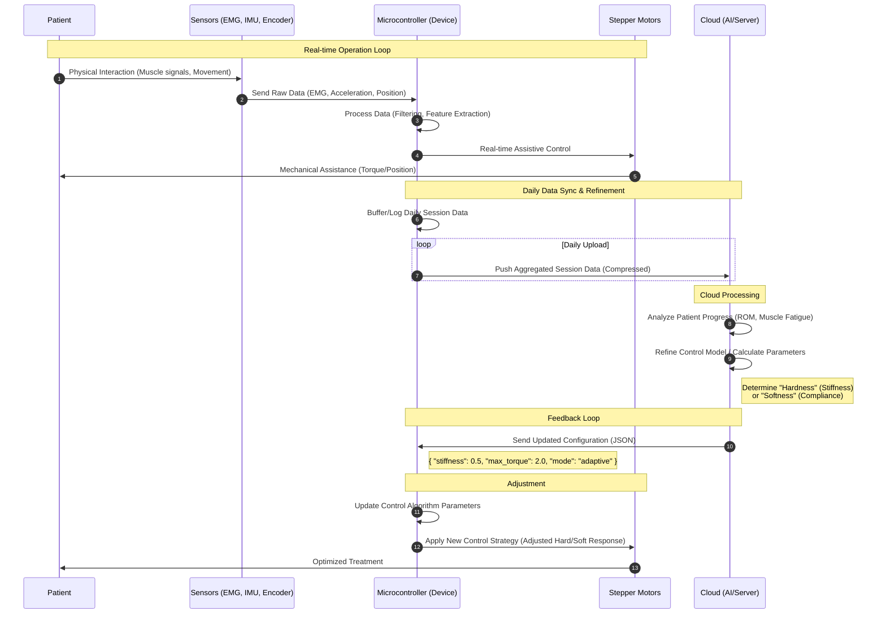

# Data Flow: AI-Driven Elbow Splint System

This document outlines the data flow from sensor collection to motor adjustment, involving daily cloud synchronization for personalized treatment adjustments.

## Data Flow Description

1.  **Data Acquisition**:
    *   **Source**: Patient's arm.
    *   **Sensors**: EMG (muscle activity), IMU (arm orientation/acceleration), Encoder (joint angle).
    *   **Destination**: Microcontroller receives this data in real-time.

2.  **Local Control & Buffering**:
    *   The Microcontroller runs a base control loop to assist the patient immediately.
    *   Simultaneously, it logs session data (performance metrics, range of motion, spasticity events) locally.

3.  **Daily Cloud Sync**:
    *   Once a day (or post-session), the Microcontroller packages the collected data and pushes it to the Cloud.

4.  **Cloud Analysis & Model Refinement**:
    *   The Cloud processes the historical data to evaluate patient progress.
    *   It determines if the splint needs to be "harder" (more rigid for support) or "softer" (more compliant for comfort/safety).
    *   It generates a new configuration profile (JSON).

5.  **Parameter Update & Motor Adjustment**:
    *   The Cloud sends the JSON body back to the Microcontroller.
    *   The Microcontroller parses the JSON and updates its internal PID/Impedance control parameters.
    *   **Result**: The Stepper Motors now behave differently (e.g., increased resistance or gentler assistance) in the next session.
