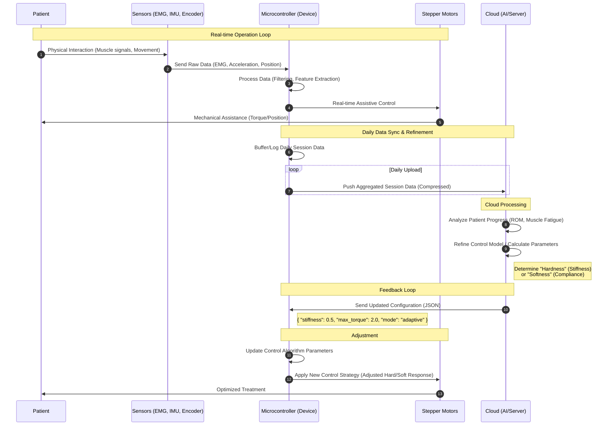
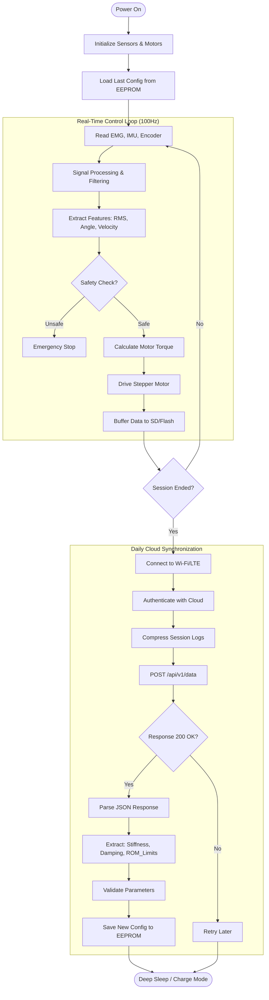
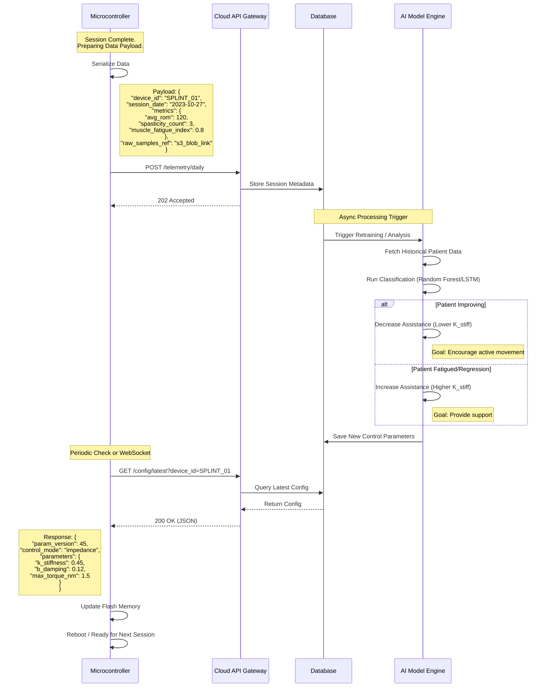

# Detailed System Design: AI-Driven Elbow Splint

This document expands on the high-level data flow, providing a granular view of the logic within the microcontroller and the API interactions with the cloud.

## 1. High-Level System Interaction

(Overview of the complete loop)

## 2. Detailed Logic Flowchart

This flowchart illustrates the internal decision-making process of the Microcontroller (MCU), separating the 100Hz real-time control loop from the daily cloud synchronization routine.

## 3. Detailed Data Sequence & API Structure

This sequence diagram details the specific API calls, JSON payloads, and backend processing logic used to refine the patient's treatment plan.

